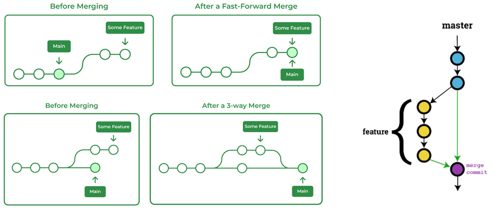

# Git Guide

## Table of Contents

1. [Git Workflow Stages](#git-workflow-stages)
2. [Initial Setup](#initial-setup)
3. [Basic Commands](#basic-commands)
4. [Essential Commands](#essential-commands)

# Git Workflow Stages

### Working Directory -> Staging Area -> Local Repository -> Remote Repository

# Initial Setup

### Set up your name and email (global settings)

```
git config --global user.name <name>
```

```
git config --global user.email <email>
```

### Check your configurations

```
git config --global user.name
```

```
git config --global user.email
```

### Set a preferred code editor (e.g., VS Code)

```
git config --global core.editor "code --wait"
```

### Open configuration for edits

```
git config --global -e
```

### Remove Old GitHub Credentials

```
Control Panel > User Accounts > Manage your Credential > Windows Credentials - Remove Github link under Generic Credential
```

### Git aliases

Git aliases are like shortcuts for longer Git commands. Instead of typing out a full command each time. (Copy this into configuration file)

```
<alias>
	up = update-git-for-windows
	logs = log --oneline --all --graph
	s = status -s
```

### Adjust line endings

- #### For Windows users

```
git config --global core.autocrlf true
```

- #### For Mac/Linux users:

```
git config --global core.autocrlf input
```

# Basic Commands

### Check the version of Git

```
git --version
```

### Update Git for Windows

```
git update-git-for-windows
```

### Create a new directory

```
mkdir <folder_name>
```

### Changing into a specific directory & Move back to one directory level

```
cd <folder_name>
cd ..
```

### Display the current working directory path

```
pwd
```

### Create an empty file

```
touch <file_name>
```

### View the contents of a file

```
cat <file_name>
```

### Listing Files

1. List files and directories in the current WD
2. List all files, including hidden ones in the current WD
3. List files tracked by Git/ SA

```
ls
ls -a
git ls-files
```

### Removing Files

1. Remove a file from the WD
2. Removes the file from both the WD and SA
3. Removes the file only from the SA, but keeps it in the WD
4. Recursively removes all files within the specified folder from the SA, but keeps it in the WD

```
rm <file_name>
git rm <file_name>
git rm --cached <file_name>
git rm -r --cached <folder_name>
```

### Renaming and Moving Files

```
git mv <original_file_name> <rename_file_name>
git mv <file_name> <new_folder_name or path>
```

# Essential Commands

> When a conflict arises, open the conflicting files in your preferred editor to resolve the conflict by making the necessary corrections. After resolving, add the changes to the staging area. Then, run the appropriate Git command `git rebase --continue or git cherry-pick --continue` to finalize the process — no manual commit message is needed.

### For initialising our new projects

```
git init
```

### Cloning the existing project

```
git clone <github_repo_URL>
```

> `HEAD`: Pointed to current working branch <br> `origin/main`: Where the latest changes happen in our main branch on the remote repository <br> `origin/HEAD`: Which is the latest branch view or work by any team member <br>

### Git Pull

Getting the latest changes from remote repo to local repo

```
git fetch <branch_name>
git merge <branch_name>

git pull origin <branch_name>

git pull --rebase
```

### Adding WA files into SA

```
git add .
git add <file_name>
git add *<file_extension>
```

### Current status of our project

```
git status
git status -s
```

### Adding SA files to LR with commit message

```
git commit -m "<message>"
```

### Git diff

For see difference between WA code and SA code, SA code and last commit, and specific commit.

```
git diff
git diff <file_name>

git diff --cached
git diff --cached <file_name>

git diff <commit_id1> <commit_id2>
```

### For see our commit history

```
git log
git log --oneline --all --graph
git log --oneline --reverse
```

### Git show

To see which changes are done in this commit, or specific file

```
git show <commit_id or HEAD>
git show <<HEAD~1>:src/index.html>
```

### Git blame

Get all line of file with the commit reference, author name and date & time, or get only the specific lines

```
git blame <src/index.html>
git blame -L <3,4,5> <src/index.html>
```

### Git Branch

```
git  branch

git branch <branch_name>

git switch -c <branch_name>
git checkout <branch_name>

git branch -d <branch_name>

git branch -m <current_branch_name> <new_branch_name>

git diff <branch_name>
git diff <branch1> <branch2>

git push -u origin <branch_name>
git push -d origin <branch_name>

git branch -r
git branch -vv
```

### Types of Git Merge

Fast-Forward merge, Non-Fast forward merge, 3-way merge, and Rebase




> To rebase, switch to your **feature branch** and run `git rebase main` (or the target branch)

```
git merge <branch_name>

git merge --no-ff <branch_name>

git rebase <branch_name>

git branch --merged
git branch --no-merged
```

### Git Stash

Git Stash allows you to store only SA by default, so first we need add to SA then do stashing

1. By default: SA Only
2. -u: WA & SA
3. -a: WA, SA, USA & gitignore

```
git stash list

git stash push -m "<stash_message>"
git stash push -u -m "<stash_message>"
git stash push -a -m "<stash_message>"

git stash apply stash@{0}

git stash drop stash@{0}

git stash clear
```

### Git Remote

```
git remote -v

git remote add origin <remote_repo_URL>

git remote set-url origin <new_remote_repo_URL>
```

### Git reset

To reset commit code to the mentioned commit code


```
git reset --soft <commit_id>
git reset --mixed <commit_id>
git reset --hard <commit_id>
```

### Git Revert

Undoes changes from a specific commit by creating a new commit that reverses those changes, without modifying the commit history.

```
git revert <commit_id>
```

### Cherry Pick

To copy commit code into our current commit without merging.


```
git cherry-pick <commit_id>
```

### Organising Commit History

```
git rebase -i <Commit_id>

pick => reword (edit the commit message)

pick => squash (meld into previous commit, and after that it ask new commit message)

pick => fixup (like "squash" but keep only the previous commit message, and it doesn't ask new commit message)
```

### Git tags

```
git tag

git tag <v1.0> <commit_id>
git tag -d <v1.0>

git push origin <v1.0>
git push origin --delete <v1.0>
```

### Git release

A Git release is always tied to a Git tag, which is a marker on a specific commit in your repository history.

1. Release notes: When creating a release, you can add detailed information about the changes included in that version, known as release notes.
2. Downloadable artifacts: You can often attach binary files (like executables or installers) to a release, allowing users to download the software directly.
3. Versioning: Git releases are usually used to manage version numbers for your software, making it clear which version is being deployed

### GitIgnore

Create a file named `.gitignore` and add the files or directories you want to ignore
